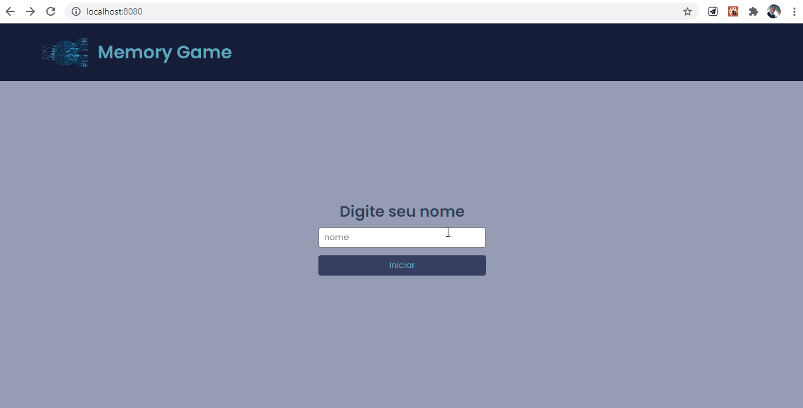
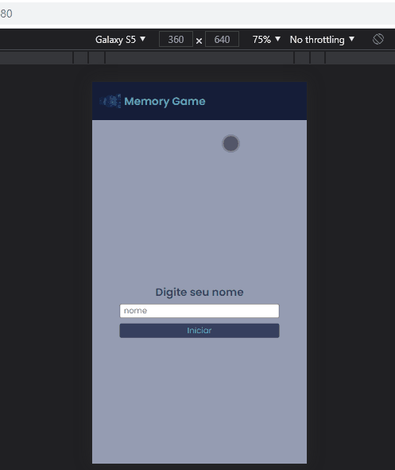

# Memory Game

  </img>
  
Versao desktop

  </img>
  
Versao mobile

# Informaçoes:

  

    A aplicaçao se resume em um jogo de memoria, aonde existe um par para cada icone.
    A missao do usuario é achar o par de cada icone que esta escondido, a cada partida ou se o usuario resetar o jogo, as variaveis voltaram ao seu estado inicial e os icones serao embaralhados novamente de forma randomica.
  

## Funcionalidades:

- Acha o par de cada icone escondido.
- Embaralhamento ramdomico dos icones.
- Marca o tempo de cada partida e os numeros de tentativas e acertos.
- Mostra um feedback ao usuario em um Modal sobre suas jogadas e tempo corrido.

## Tecnologias:

- React
- react-dom
- react-router-dom
- react-modal
- Scss
- Webpack
- Babel

## Configuraçao:

<pre>
  A aplicaçao foi configurada do zero sem o uso do create-react-app para fins de apredizado.

scripts
  npm start - inicia a aplicaçao com webpack-dev-server
  npm build - gera o arquivo final de build
</pre>
